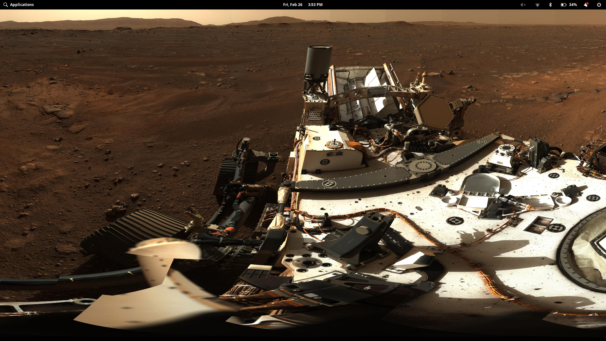
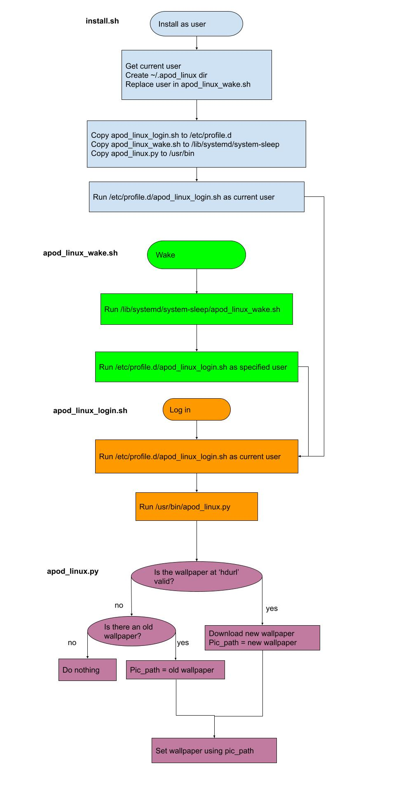

<!----------------------------------------------------------------------------->
<!-- Filename: README.md                                       /          \  -->
<!-- Project : APOD_Linux                                     |     ()     | -->
<!-- Date    : 02/21/2019                                     |            | -->
<!-- Author  : Dana Hynes                                     |   \____/   | -->
<!-- License : WTFPLv2                                         \          /  -->
<!----------------------------------------------------------------------------->

# APOD_Linux
## "It mostly works™"

A small program that runs at every login/wake to set your wallpaper to NASA's
Astronomy Picture of the Day.



# Installing

To install, clone the git repo:
```bash
foo@bar:~$ cd ~/Downloads
foo@bar:~/Downloads$ git clone https://github.com/danahynes/APOD_Linux
foo@bar:~/Downloads$ cd APOD_Linux
```

Once you do that, you can install by:
```bash
foo@bar:~/Downloads/APOD_Linux$ ./install.sh
```
You can also download the
[latest release](http://github.com/danahynes/APOD_Linux/releases/latest), unzip
it, and run the install.sh file from there.

**DO NOT USE SUDO TO INSTALL.**

It causes set-wallpaper to try and recursively
delete your entire hard drive. Bad, right? WTF!!! Still trying to figure this
out. Installing without sudo seems to work. The install script will warn you if
you use sudo, so you should be OK.

# Uninstalling

To uninstall, go to the git directory and run:
```bash
foo@bar:~/Downloads/APOD_Linux$ ./uninstall.sh
```
You can safely use sudo here, but it's not necessary.

Or you can remove the files manually:
```bash
foo@bar:~$ sudo rm -rf /etc/profile.d/apod_linux_login.sh
foo@bar:~$ sudo rm -rf /lib/systemd/system-sleep/apod_linux_wake.sh
foo@bar:~$ sudo rm -rf /usr/bin/apod_linux.py
foo@bar:~$ sudo rm -rf /home/<USER>/.apod_linux
```

where ```<USER>``` is your username.

# Notes

Originally, this program tried to use *anacron* to run a script once a day. But,
I could not get the *anacron* code to work, mostly because *anacron* wants to
run as root, and all my code (mostly ~~*gsettings*~~ *set-wallpaper*) wants to
run as the current user. So I gave up and made it run when a user logs in. It
then waits 30 seconds for an internet connection, downloads the latest APOD
picture, and sets that as the wallpaper.

The wallpaper may not change based on the following conditions:
1. You do not have an internet connection.
2. The Astronomy Picture of the Day is not a picture (sometimes it's a video,
and recently they posted an interactive GIF [fun, but won't work as wallpaper]).
3. Any of the above and you have never downloaded a working picture.

The script does try to fall back to the last working picture if any of the above
happen, however if it can't, it won't change your wallpaper so your system
settings should still apply.

You can check the log at ~/.apod_linux/apod_linux.log to find out if the script
is working, and what it's doing.

If you're like me, and use a laptop, you probably don't log in/out very often,
but only close your laptop lid to put the system to sleep. Running the script
when a user logs in after sleep/wake was tricky, as Linux does not consider this
an actual login, only a speedbump in the current session (you're not actually
logging in, only unlocking the screen). That's one reason I wanted the script to
run every hour, but this caused problems after I set up my laptop to dual-boot
with Windows (along with other issues, so probably not the script's fault). The
script would hang the login process, even with forking.

The solution to this was to run the script as su after waking (wake scripts only
run as root, and we already know that won't change the current user's
wallpaper). For that, I needed a user name, so that is set during install. It's
hacky, but it works. A better solution would be if systemd supported running
user scripts after wake/enter password, but that's not something that will
probably be coming soon.

One of Linux's biggest drawing points is, in my opinion, also one of it's
biggest drawbacks: modularity. There are umpteen different distros with as many
backends, configurations, and desktop environments. This app was written and
tested on elementaryOS 5 Hera, which is based on Ubuntu with the GNOME desktop.
As such, it uses a program called ~~*gsettings*~~ *set_wallpaper* to change the
desktop wallpaper.
If you are using a similar ~~GNOME-based~~ elementaryOS distro, it will probably
work for you. But if you're using something with, say, a KDE desktop then it
probably won't, and you'll need to change the part of the script that says "THIS
PART IS ~~GNOME~~ ELEMENTARY SPECIFIC" to allow you to change the wallpaper. I
don't have a KDE system installed, and I certainly don't have the time, energy,
or patience to test for every Desktop Environment out there.

I know there is code out there to test for different DEs and set the wallpaper
accordingly, but as I said I don't have any other working Linux setups right
now, so if this app doesn't work for you, feel free to fork it, change it, and
send a pull request or a DM and I'll look into it.

Here is a flowchart of what the various scripts do:



~~Also note that on elementary OS, this does not change you greeter preview:~~


~~The top half of this window should show the current wallpaper, as it does when
you set the wallpaper from the Settings app. I have a pretty good idea how to
fix this, but it needs more testing as the last time I tried it, it tried to
recursively delete my hard drive. YIKES!~~

# TODO

1. Set wallpaper on non-~~GNOME~~ elementaryOS desktops
1. ~~Set wallpaper preview in GDM greeter~~

# -)
